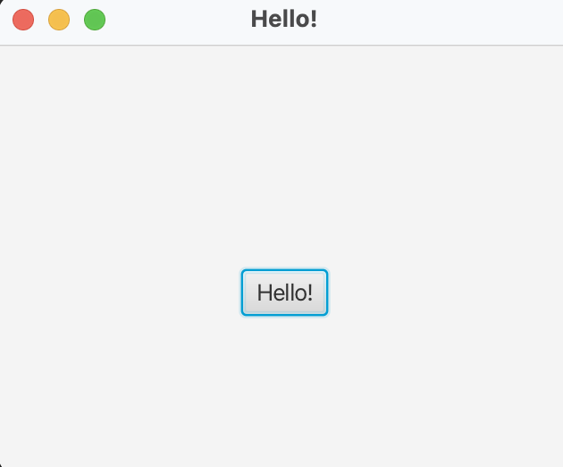
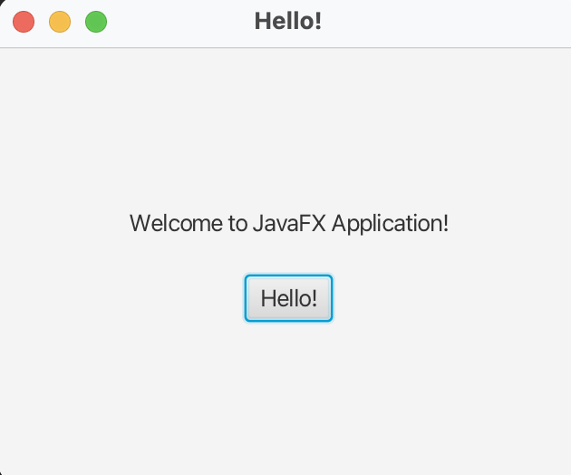
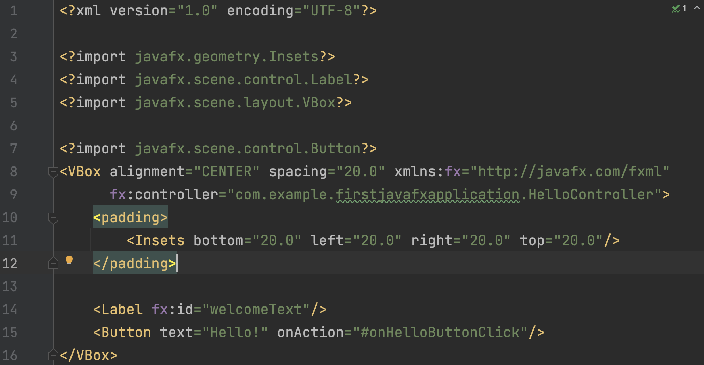
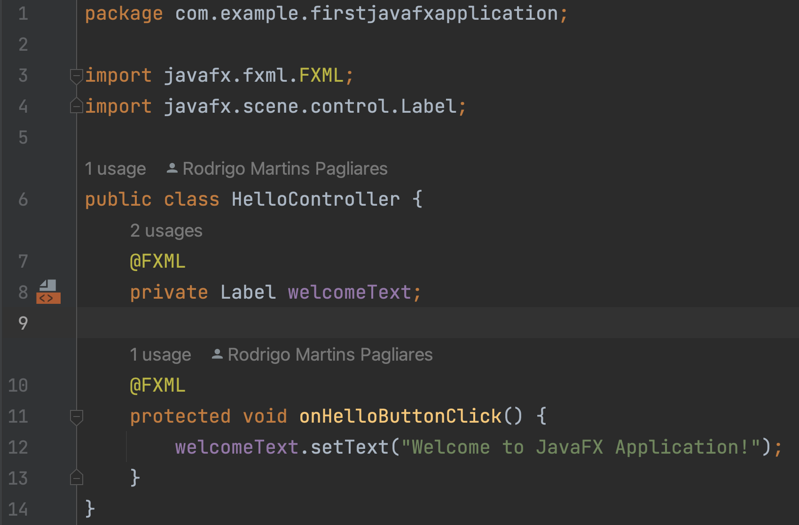
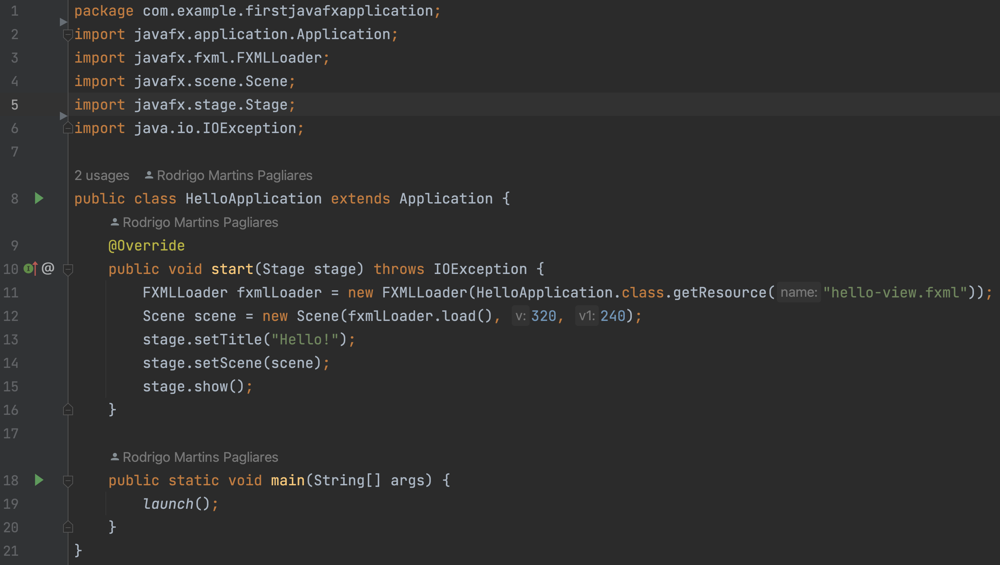
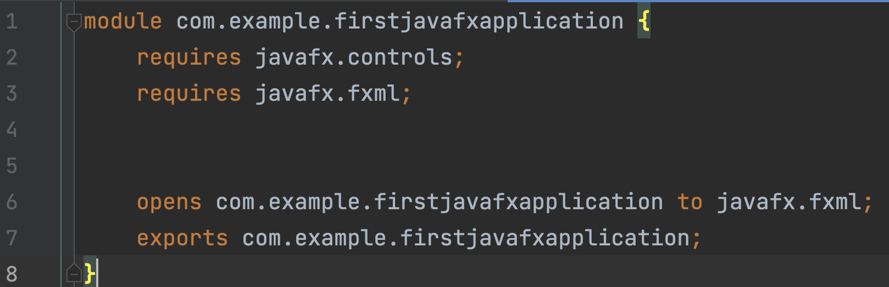
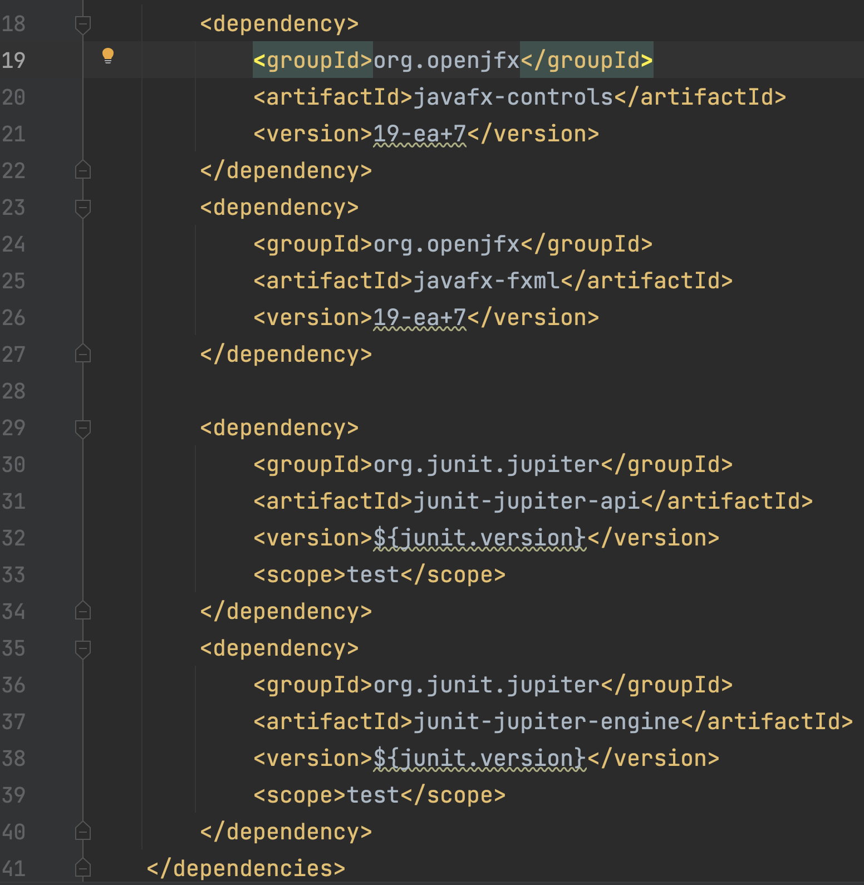
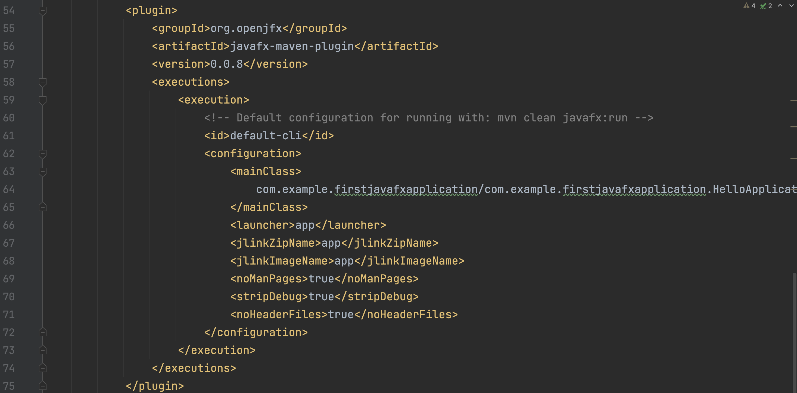
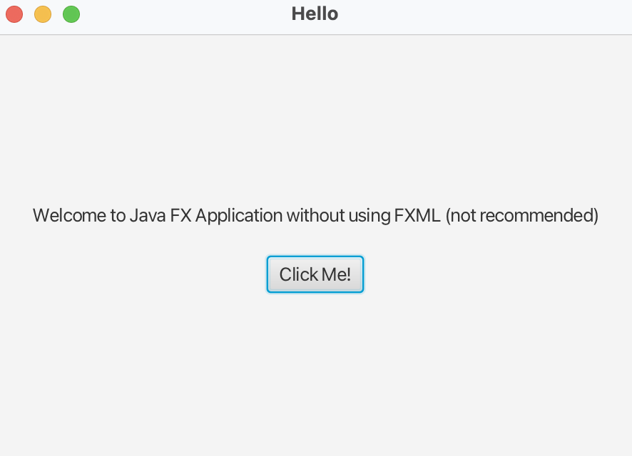

# JavaFX hands-on

Welcome to the repository containing examples used in the classes about Java Desktop Development with JAVA FX. The classes are taught by Rodrigo Martins Pagliares in the Computer Science undergraduate course at UNIFAL-MG, Brazil. 

I thinnk this repository is a valuable resource for students who want to review class examples or further explore JavaFX development. I hope you find it helpful and informative!

## Outline

### Part I - First steps with JavaFX

<a href="https://github.com/pagliares/java-fx-hands-on#01---first-javafx-application">01 - First JavaFX application with fxml</a>

<a href="https://github.com/pagliares/java-fx-hands-on#02---first-javafx-application-without-fxml-not-recommended">02 - First JavaFX application without fxml</a>

<a href="https://github.com/pagliares/java-fx-hands-on#03---javafx-application-lifecyle-the-method-init">03 - The method init of the JavaFX application lifecycle</a>

<a href="#04---lifecyle--threads">04 - Lifecycle and threads</a>

<a href="#05---the-method-stop-of-the-javafx-application-lifecycle">05 - The method stop of the JavaFX application lifecycle</a>

## Part I - First steps with JavaFX

### 01 - First JavaFX application with fxml 

- <small><a href="https://github.com/pagliares/java-fx-hands-on#outline">Back to Outline</a></small>
- <strong>Project source:</strong> FirstJavaFXApplication

 

 

<strong>Summary</strong>

<strong>Note</strong>: This example was created with the IntelliJ assistant for JavaFX application (not the Maven assistant !). I recommend using this assistant in IntelliJ in order to have a HelloWorld kind off application out of the box when creating the project and avoid headache configuring JavaFX to work in intelliJ form a Maven project created by scratch.

<strong>File hello-view.fxml</strong>

 

Overall, this FXML file defines a simple user interface with a label and a button, and specifies that the HelloController class should be used as the controller for the user interface.

The first three lines are import statements for the JavaFX layout and control classes used in the FXML file.

The <VBox> tag defines a vertical box layout container, which will contain the user interface elements.

The alignment and spacing attributes of the <VBox> tag set the alignment and spacing properties of the layout.

The <padding> tag sets the padding of the <VBox> container.

The <Label> tag creates a label control with an fx:id attribute of welcomeText. The fx:id attribute is used to uniquely identify the control within the FXML file.

The <Button> tag creates a button control with the text "Hello!" and an onAction attribute of #onHelloButtonClick. This specifies that when the button is clicked, the onHelloButtonClick method of the HelloController class should be invoked.

The xmlns:fx attribute is an XML namespace declaration for the http://javafx.com/fxml namespace, which is used to reference JavaFX-specific FXML elements and attributes.

The fx:controller attribute of the <VBox> tag specifies the fully-qualified name of the Java class that serves as the controller for this FXML file. In this case, it is com.example.firstjavafxapplication.HelloController.

<strong>File HelloController.java</strong>

 

Overall, this Java class defines a controller that handles the user input of clicking the "Hello!" button in the FXML file and updates the label control with the text "Welcome to JavaFX Application!".

The HelloController class is defined as a public class.

The @FXML annotation is used to mark the welcomeText instance variable as an element in the FXML file with an fx:id attribute of welcomeText. This is how the controller is able to access and manipulate the label control in the FXML file.

The onHelloButtonClick() method is marked with the @FXML annotation and is called when the button in the FXML file is clicked. The method sets the text of the welcomeText label control to "Welcome to JavaFX Application!".

The onHelloButtonClick() method is marked as protected, which means it can only be accessed by subclasses of HelloController.

<strong>File HelloApplication.java</strong>

 

Overall, this Java class defines the entry point of the JavaFX application and sets up the user interface by loading the FXML file and creating a Scene object to display it on the Stage.

The HelloApplication class is defined as a public class that extends the Application class.

The start() method is overridden and is called when the JavaFX application is launched. In this method, an FXMLLoader is created that loads the FXML file with the user interface. A Scene object is then created with the loaded FXML root node and set to the specified size. The Scene object is then set on the Stage object, which is created by the launch() method. Finally, the Stage object is displayed on the screen.

The main() method is a static method that is called to launch the JavaFX application. The launch() method is called to start the JavaFX application.

The HelloApplication class does not define any other methods or variables.

<strong>File module-info.java</strong>

 

Overall, this module descriptor file specifies the module dependencies, opens the package to the javafx.fxml module, and exports the package to be visible to other modules.

The module keyword is used to declare that this file is a module descriptor.

The com.example.firstjavafxapplication is the name of the module.

The requires keyword is used to specify the dependencies of the module. In this case, the javafx.controls and javafx.fxml modules are required.

The opens keyword is used to specify the packages that should be accessible to the javafx.fxml module. In this case, the com.example.firstjavafxapplication package is opened to the javafx.fxml module.

The exports keyword is used to specify the packages that should be visible to other modules. In this case, the com.example.firstjavafxapplication package is exported.

<strong>File pom.xml </strong>

 

 

File for a Maven project that includes dependencies and plugins for building a JavaFX application. Here's a breakdown of the relevant parts:

The dependencies section lists the required dependencies for the project. In this case, the project requires the javafx-controls and javafx-fxml dependencies to use JavaFX components and features in the application. The project also includes JUnit Jupiter API and engine dependencies for unit testing.

The build section includes plugins that are used during the build process. The maven-compiler-plugin is used to compile the Java source code. The plugin is configured to use Java 19 for both the source and target. The javafx-maven-plugin is used to package and run the JavaFX application. It is configured to use the HelloApplication class as the main class to launch the application. Other configuration options include specifying the name of the launcher, the name of the JLink zip and image, and turning off debug information and header files.

### 02 - First JavaFX application without fxml (not recommended)

- <small><a href="https://github.com/pagliares/java-fx-hands-on#outline">Back to Outline</a></small>
- <strong>Project source:</strong> first-javafx-application-without-fxml

 

<strong>Summary</strong>

<strong>Note</strong>: This example was created with the IntelliJ assistant for JavaFX application (not the Maven assistant !). I recommend using this assistant in IntelliJ in order to have a HelloWorld kind off application out of the box when creating the project and avoid headache configuring JavaFX to work in intelliJ form a Maven project created by scratch. After project creation I removed some files to illustrate how to use JavaFX withou FXML. This is the same project of example 01 without hello-view.fxml and the class HelloController.

This is a JavaFX application that creates a simple UI without using FXML. The UI consists of a vertical box (VBox) that contains a Label and a Button. When the button is clicked, the label text is changed to a welcome message.

The start method is the main entry point for JavaFX applications. It sets up the UI by creating a VBox and adding a Label and Button to it. It also creates a Scene object and sets it as the scene for the Stage. Finally, it sets the title of the Stage and shows it.

The main method simply calls the launch method to start the application.

### 03 - JavaFX application lifecyle (the method init)

- <small><a href="https://github.com/pagliares/java-fx-hands-on#outline">Back to Outline</a></small>
- <strong>Project source:</strong> java-fx-application-lifecycle

<strong>Summary</strong>

This example demonstrates the use of the init method of the lifecycle of a JavaFX application.

<pre>
public class HelloApplication extends Application {
   ...
   @Override
    public void init() throws Exception {
        System.out.println("Before the application starts");
        Thread.sleep(5000); // Wait 5 seconds before application starts (method start of the lifecycle)
    }
}
</pre>

The provided code snippet demonstrates an override of the init() method in a JavaFX application. Here's a breakdown of what the code does:

1. The @Override annotation indicates that the init() method is being overridden from a superclass or interface. It ensures that the method signature matches the one in the superclass or interface.

2. The init() method is a part of the JavaFX application lifecycle and is executed before the application starts. It's typically used for any necessary setup or initialization tasks.

3. Inside the init() method, there is a System.out.println() statement that prints the message "Before the application starts" to the console. This line simply displays a message for informational purposes.

4. The Thread.sleep(5000) line pauses the execution of the init() method for 5 seconds (5000 milliseconds). This means that the application will wait for 5 seconds before proceeding to the start() method, which is the next step in the application lifecycle.

The purpose of the Thread.sleep() call in this code snippet might be to introduce an artificial delay before the application starts, possibly to give some time for other initialization tasks or to create a specific user experience. However, it's worth noting that introducing long delays in the application initialization phase may negatively impact the user experience, as the application might appear unresponsive during that time.

Remember to exercise caution when using delays in application initialization and ensure that they serve a valid purpose and do not disrupt the overall usability of your application.

### 04 - Lifecyle & threads  

- <small><a href="https://github.com/pagliares/java-fx-hands-on#outline">Back to Outline</a></small>
- <strong>Project source:</strong> lifecycle-and-threads

<strong>Summary</strong>

- To test this example, click the Block Me button first and then try to click the Click me button
<pre>
// package and import statements ommited
   
public class HelloApplication extends Application {

    @Override
    public void init() throws Exception {
        // What thread does init method belong? answer: JavaFX-Launcher thread
        System.out.println("Thread name...: "+ Thread.currentThread().getName());
    }

    @Override
    public void start(Stage stage) throws Exception {
        VBox root = new VBox();
        root.setAlignment(Pos.CENTER);
        root.setPadding(new Insets(20, 20, 20, 20));
        root.setSpacing(20);

        Label text = new Label("");

        Button firstButton = new Button("Click Me!");
        firstButton.setOnAction(e -> text.setText("Learning JavaFX threads & lifecycle"));

        Button secondButton = new Button("Block me!");
        secondButton.setOnAction(event ->{
            System.out.println("GUI is blocked now");
            try {
                Thread.sleep(10_000);
            } catch (InterruptedException e){
                e.printStackTrace();
            }
        });

        root.getChildren().addAll(text, firstButton, secondButton);

        Scene scene = new Scene(root, 450, 300);
        stage.setScene(scene);
        stage.setTitle("JavaFX threads");
        stage.show();
    }

    public static void main(String[] args) {
        launch();
    }
}
</pre>

The provided code snippet is a JavaFX application that demonstrates the usage of threads and the application lifecycle. Here's a breakdown of the code:

1. The HelloApplication class extends the Application class, which is the main entry point for JavaFX applications.

2. The init() method is overridden and prints the name of the thread it belongs to. In this case, it belongs to the JavaFX-Launcher thread.

3. The start() method is overridden and serves as the entry point for setting up the JavaFX application's user interface.

4. Inside the start() method, a VBox layout is created to hold the application's components (a Label and two Button objects). The VBox is configured with alignment, padding, and spacing properties to define its appearance.

5. The Label object named text is initially empty and will be used to display a message when the "Click Me!" button is clicked.

6. The "Click Me!" button (firstButton) is created and configured with an event handler. When the button is clicked, the event handler sets the text of the text label to "Learning JavaFX threads & lifecycle".

7. The "Block me!" button (secondButton) is created and configured with an event handler. When the button is clicked, the event handler blocks the GUI thread for 10 seconds by invoking Thread.sleep(10_000). This blocking operation simulates a long-running task that could potentially freeze the user interface.

8. The root VBox layout is populated with the text label, firstButton, and secondButton.

9. A Scene object is created, which represents the content to be displayed within the application window. The root layout is set as the root of the scene, and the dimensions of the scene are set to 450x300 pixels.

10. The Stage object represents the main application window. The created Scene is set as the content of the stage. The title of the stage is set to "JavaFX threads".

11. Finally, the stage.show() method is called to display the application window.

12. The main() method serves as the entry point for the JavaFX application. It calls the launch() method, which initializes the JavaFX toolkit and starts the application.

To test this application, you can click the "Block Me" button first and then try to click the "Click Me!" button. While the "Block Me" button is being processed, the GUI will be unresponsive for 10 seconds due to the blocking Thread.sleep() call. This demonstrates the importance of using threads to handle time-consuming tasks and keeping the user interface responsive.

### 05 - The method stop of the JavaFX application lifecycle

- <small><a href="https://github.com/pagliares/java-fx-hands-on#outline">Back to Outline</a></small>
- <strong>Project source:</strong> lifecycle-stop

<strong>Summary</strong>

- Two ways of terminating a JavaFX application: implicitly and explicitly.

<pre>
// package and import statements ommited

public class HelloApplication extends Application {

    @Override
    public void init() throws Exception {
        // What thread does init method belong? answer: JavaFX-Launcher thread
        System.out.println("init() method is on thread named..: "+ Thread.currentThread().getName());
    }

    @Override
    public void start(Stage stage) throws Exception {
   
        /** 
           If we use Platform.setImplicitExit(false), when the user clicks the x symbol in the Stage, the application closes visually, but it is still running
           Usually not changed to false, but it can be useful in some specific scenarios when, for instance,
            multiple windows are open at the same time
         **/

        // Platform.setImplicitExit(false);

        VBox root = new VBox();
        root.setAlignment(Pos.CENTER);
        root.setPadding(new Insets(20, 20, 20, 20));
        root.setSpacing(20);

        Label text = new Label("");

        Button firstButton = new Button("Click Me!");
        firstButton.setOnAction(e -> text.setText("Learning JavaFX threads & lifecycle"));

        Button secondButton = new Button("Exit explicitly!");
        secondButton.setOnAction(event -> Platform.exit()); // Explicitly exits

        root.getChildren().addAll(text, firstButton, secondButton);

        Scene scene = new Scene(root, 450, 300);
        stage.setScene(scene);
        stage.setTitle("JavaFX threads");
        stage.show();
    }

    @Override
    public void stop() throws Exception {
        System.out.println("stop() method is on thread named..: " + Thread.currentThread().getName());
        System.out.println("Closing the application");
    }

    public static void main(String[] args) {
        launch();
    }
}
</pre>

The provided code snippet is a JavaFX application that demonstrates the usage of the stop() method and explicitly exiting the application. Here's a breakdown of the code:

1. The HelloApplication class extends the Application class, which is the main entry point for JavaFX applications.

2. The init() method is overridden and prints the name of the thread it belongs to. In this case, it belongs to the JavaFX-Launcher thread.

3. The start() method is overridden and serves as the entry point for setting up the JavaFX application's user interface.

4. Inside the start() method, a VBox layout is created to hold the application's components (a Label and two Button objects). The VBox is configured with alignment, padding, and spacing properties to define its appearance.

5. The Label object named text is initially empty and will be used to display a message when the "Click Me!" button is clicked.

6. The "Click Me!" button (firstButton) is created and configured with an event handler. When the button is clicked, the event handler sets the text of the text label to "Learning JavaFX threads & lifecycle".

7. The "Exit explicitly!" button (secondButton) is created and configured with an event handler. When the button is clicked, the Platform.exit() method is called to explicitly exit the application. This will close the application window and terminate the JavaFX application.

8. The root VBox layout is populated with the text label, firstButton, and secondButton.

9. A Scene object is created, which represents the content to be displayed within the application window. The root layout is set as the root of the scene, and the dimensions of the scene are set to 450x300 pixels.

10. The Stage object represents the main application window. The created Scene is set as the content of the stage. The title of the stage is set to "JavaFX threads".

11. Finally, the stage.show() method is called to display the application window.

12. The stop() method is overridden and is called when the application is about to be stopped. In this example, it prints the name of the thread it belongs to and displays a message indicating that the application is closing.

13. The main() method serves as the entry point for the JavaFX application. It calls the launch() method, which initializes the JavaFX toolkit and starts the application.

When running this application, you can click the "Click Me!" button to change the text displayed in the label. Additionally, clicking the "Exit explicitly!" button will call Platform.exit() to explicitly exit the application, triggering the stop() method. The stop() method will then print the name of the thread it belongs to and display a message indicating that the application is closing.

It's worth noting that the stop() method is typically used to perform any necessary cleanup or resource release before the application exits.
